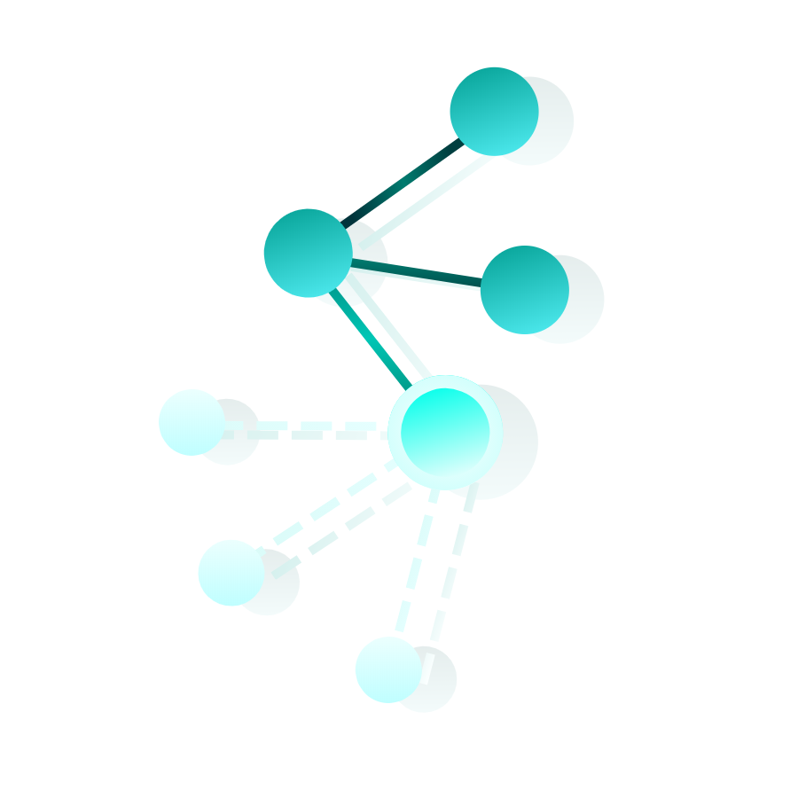

<div id="top"></div>

<!-- PROJECT LOGO -->
<div align="center">

  <a href="https://github.com/y3snt/Hexer-Visualization">
    
  </a>


 <h3 align="center">Hexer Visualization</h3>
  <p align="center">
    Visualization of an algorithm that solves XVI Polish Olympiad in Informatics (Stage III) problem - Hexer
    <br />
    <br />
    <a href="https://github.com/y3snt/Hexer-Visualization/issues">Report Bug</a>
    ·
    <a href="https://github.com/y3snt/Hexer-Visualization/issues">Request Feature</a>
  </p>
</div>

# 
#### Link to problem (ENG): https://www.oi.edu.pl/old/html/zadania/oi16/3/wietask.pdf
#### Link to problem (PL): https://www.oi.edu.pl/old/html/zadania/oi16/3/wie-1.pdf
<br />


<!-- TABLE OF CONTENTS -->
<details>
  <summary>Table of Contents</summary>
  <ol>
    <li><a href="#about-the-project">About The Project</a></li>
    <li><a href="#required-modules">Required Modules</a></li>
    <li><a href="#project-description">Project Description</a></li>
    <li><a href="#algorithm---short-description">Algorithm - Short Description</a></li>
    <li><a href="#future-updates">Future Updates</a></li>
    <li><a href="#contact">Contact</a></li>
  </ol>
</details>


## About The Project

![Screen Shot][screenshot]

I found this problem so interesting, that I've decided to create animation that visualizes solution to the problem. I thinks it helps to understand the algorithm better by showing the path, not for just visited nodes, but for visited nodes with states (swords collected by Hexer at the moment of entering the node).

### Built With

[![Python]][Python-url] 
#### `v3.8.10`

<h3 align="right"><a href="#top">⇧</a></h3>


## Required Modules 

##### Matplotlib
```sh
$ pip install matplotlib
```

##### Networkx
```sh
$ pip install networkx[default]
```

<h3 align="right"><a href="#top">⇧</a></h3>


## Project Description

![Graph Description][description]

### How to run the program
There is a script named `run.py` inside the project folder. Change working directory in terminal to this folder and type:

```sh
$ python3 run.py
```
The window with animation will appear (full screen) and 5 seconds after the animation ends, the window will close.

### Configuration
Graphics and animation settings can be changed in the `config` folder. (animation - `config.json`, graphics - `colors.json`, `sizes.json`)
<br />
Input (initial graph) can be changed in `input.txt` in `data` folder.

<h3 align="right"><a href="#top">⇧</a></h3>


## Algorithm - Short Description

#### TL;DR Dijkstra + bit masks

The algorithm that solves the problem is modified Dijkstra. Instead of simply counting distances to every node from starting node (node 1 in this case) it counts distance to every node for every possible subset of swords that can be collected by Hexer. This sword subsets are stored in bit masks.

Initially all distances are set to infinity.
At the beggining 1-st node is added to the priority queue (with distance 0 and initial bitmask - swords collected in 1-st node).

Then this node (and every node that will be added to queue) is taken from the queue and processed: every neighbour of this node that we can enter to (by defeating monsters on the edge with currently collected swords) is checked; if the distance from current node to this neighbour is smaller than previous distance to the neighbour, we put this new distance to the queue with currently collected swords + swords collected by entering the neighbour (state for this neighbour node).

Additionally when node is processed it gets marked as processed, so it will be processed only once (for particular state).

When distance to n-th node is found or the queue is empty the algorithm stops.

##### My implementation of this algorithm can be found in c++ or python version in the `algorithms` folder.

#### More information (PL): https://oi.edu.pl/static/attachment/20110704/oi16.pdf (page 133)

<h3 align="right"><a href="#top">⇧</a></h3>


## Future Updates

- [ ] Random graph generator
- [ ] Show initial graph (with animation)
- [ ] Adjust node size and font size besed on number of nodes
- [ ] Visualize discarded nodes (with on/off option in config)

##### I will come back to this project later, because currently I'm working on another project.

<h3 align="right"><a href="#top">⇧</a></h3>

<!-- CONTACT -->
## Contact

[![LinkedIn][linkedin-shield]][linkedin-url]

Magdalena Doleśniak
<br />
magda.dolesniak@gmail.com

<h3 align="right"><a href="#top">⇧</a></h3>


<!-- MARKDOWN LINKS & IMAGES -->
<!-- https://www.markdownguide.org/basic-syntax/#reference-style-links -->
[linkedin-shield]: https://img.shields.io/badge/LinkedIn-0077B5?style=for-the-badge&logo=linkedin&logoColor=white
[linkedin-url]: https://www.linkedin.com/in/magdalena-dole%C5%9Bniak/
[screenshot]: images/screenshot.png
[description]: images/graph_description.png
[Python]: https://img.shields.io/badge/python-3670A0?style=for-the-badge&logo=python&logoColor=ffdd54
[Python-url]: https://www.python.org/
